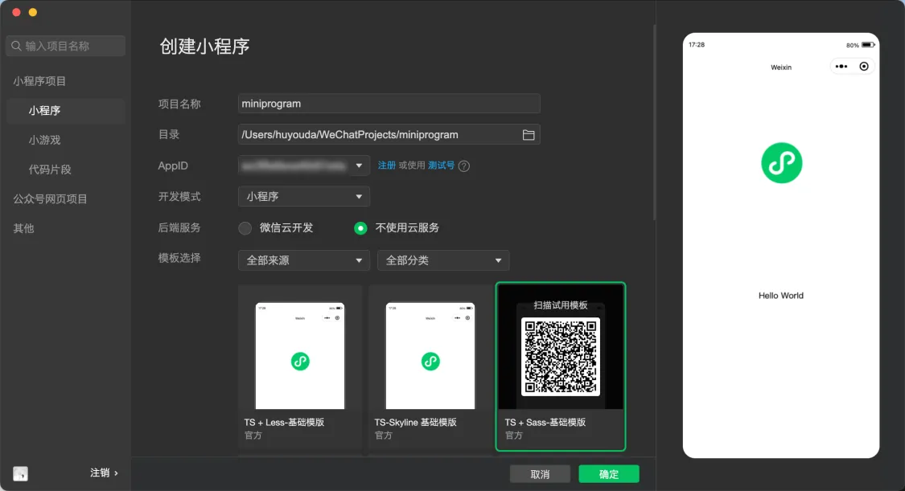
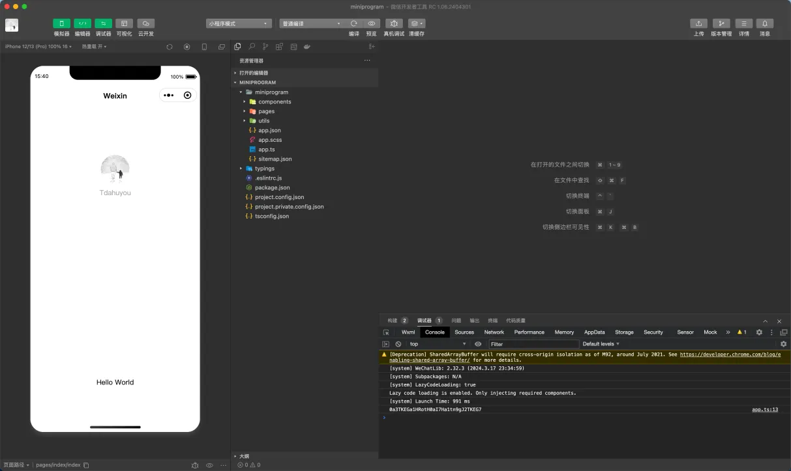

# [0001. 创建你的第一个微信小程序](https://github.com/Tdahuyou/TNotes.miniprogram/tree/main/notes/0001.%20%E5%88%9B%E5%BB%BA%E4%BD%A0%E7%9A%84%E7%AC%AC%E4%B8%80%E4%B8%AA%E5%BE%AE%E4%BF%A1%E5%B0%8F%E7%A8%8B%E5%BA%8F)


<!-- region:toc -->
- [1. 📝 笔记内容简介](#1--笔记内容简介)
- [2. 📒 创建小程序](#2--创建小程序)
- [3. 📒 认识目录结构](#3--认识目录结构)
<!-- endregion:toc -->

## 1. 📝 笔记内容简介

- 介绍了如何使用微信开发者工具创建一个基于 TypeScript 和 Sass 的微信小程序，并简要概述了新创建项目的基本目录结构和文件作用。
- 强调了对于初学者来说，即使不熟悉 TypeScript 对开发影响不大，因为最终运行的是 JavaScript 代码；同时说明了各个关键配置文件如 `app.json`、`app.ts` 和页面相关文件的作用。

## 2. 📒 创建小程序

- 学会自己创建一个微信小程序，并对刚创建好的小程序的目录文件有个初步的认识。
- TS 可选可不选，微信小程序对于 TS 的支持不是特别友好。
  - 
- 打开微信开发者工具，指定创建小程序的相关配置：
- 项目名称
- 目录
  - 项目所存放的本地位置。
  - 点击右边的  图标，可以手动配置该项目的位置。
- AppID
  - miniprogram-wechat.0011
- 开发模式
  - 选小程序 
  - 有关「插件」的内容，后续学到会介绍。
- 后端服务
  - 选择不使用云服务
  - 有关【云服务】的内容，后续学到会介绍。
- 模板选择
  - 选择官方的【TS + Sass-基础模板】
  - 选择 TS 的目的是为了更便捷地去查看相关数据和 API 的结构。
    - 即便还不会 TS，影响也不大，因为最终运行的起始是 JS，TS 并不会影响程序最终运行的逻辑，可以将相关的类型注解信息给忽略掉。
    - 没接触过 TS 的话，正好可以借此教程来熟悉熟悉。
    - 有关 TS 的内容，可以看看 typescript 笔记仓库。
  - 选择 Sass 的目的
    - 为了更方便地书写 css 样式。
    - 也可以选择 TS + Less，习惯用哪个就选哪个即可。
- 一切配置填写完毕后，点击右下角的【确定】按钮，即可创建你的第一个微信小程序。
  - 

## 3. 📒 认识目录结构

- 使用微信开发者工具打开这个小程序，可以看到有以下文件。
  - 
- 认识目录结构

```bash
.
├── miniprogram # 小程序的核心文件夹，包含所有前端代码。
│   ├── app.json # 全局配置文件，包括窗口背景色、导航条样式、页面路径等。
│   ├── app.scss # 全局样式文件，定义整个小程序的通用样式。
│   ├── app.ts # 小程序的入口文件和全局 TS 文件，定义全局变量或全局数据。
│   ├── components # 存放小程序的自定义组件。
│   │   └── navigation-bar # 示例自定义组件目录。
│   │       ├── navigation-bar.json # 组件配置文件，定义组件的属性等。
│   │       ├── navigation-bar.scss # 组件的样式文件。
│   │       ├── navigation-bar.ts # 组件的逻辑文件。
│   │       └── navigation-bar.wxml # 组件的结构文件。
│   ├── pages # 包含小程序的所有页面。
│   │   ├── index # 首页目录。
│   │   │   ├── index.json # 页面配置文件。
│   │   │   ├── index.scss # 页面样式。
│   │   │   ├── index.ts # 页面逻辑。
│   │   │   └── index.wxml # 页面结构。
│   │   └── logs # 日志页面目录。
│   │       ├── logs.json # 页面配置文件。
│   │       ├── logs.scss # 页面样式。
│   │       ├── logs.ts # 页面逻辑。
│   │       └── logs.wxml # 页面结构。
│   ├── sitemap.json # 配置小程序页面路径以供微信搜索使用。
│   └── utils # 工具代码目录，例如通用函数或服务。
│       └── util.ts # 工具函数文件。
├── package.json # 定义项目的依赖库及其他 Node.js 项目配置信息。
├── project.config.json # 小程序项目的配置文件，包括项目名称、编译设置等。
├── project.private.config.json # 包含私密配置，通常不上传至代码仓库。
├── tsconfig.json # TypeScript 编译选项文件。
└── typings # 包含 TypeScript 的类型定义文件。
    ├── index.d.ts # 主要类型定义文件。
    └── types # 更详细的类型定义文件目录。
        ├── index.d.ts # 基本类型定义文件。
        └── wx # 小程序 API 的类型定义文件夹。
            ├── index.d.ts # 微信 API 基本类型定义。
            ├── lib.wx.api.d.ts # 微信 API 函数类型定义。
            ├── lib.wx.app.d.ts # 微信小程序 App 类型定义。
            ├── lib.wx.behavior.d.ts # 微信 behaviors 类型定义。
            ├── lib.wx.canvas.d.ts # 微信 canvas 类型定义。
            ├── lib.wx.cloud.d.ts # 微信云开发类型定义。
            ├── lib.wx.component.d.ts # 微信组件类型定义。
            ├── lib.wx.event.d.ts # 微信事件类型定义。
            ├── lib.wx.page.d.ts # 微信页面类型定义。
            ├── lib.wx.phys3D.d.ts # 微信物理引擎3D类型定义。
            ├── lib.wx.wasm.d.ts # 微信 WebAssembly 类型定义。
            └── lib.wx.xr-frame.d.ts # 微信 XR 框架类型定义。
```

- 全局
  - pages 中放的是页面级别的内容，而以 app 开头的一些文件，表示的是全局级别的内容。比如：
    - app.ts 入口文件
    - app.json 全局配置文件
    - app.scss 全局样式文件
- 页面相关
  - 其中 pages 表示页面，该目录下存放的是小程序中的所有页面。
  - 刚初始化好的项目有 index 首页 + logs 日志页，这两个页面。
  - 仔细观察你会发现，它们的结构基本都是一样的：
    - `xxx.json` 文件中放配置
    - `xxx.ts` 文件中放逻辑 —— js
    - `xxx.scss` 文件中放样式 —— css
    - `xxx.wxml` 文件中放结构 —— html
      - wxml 的全称叫做 wei xin markup language。
      - 基本上语法就和 html 一样的，只不过不能使用 html 里面的那些标签，使用的是小程序为我们提供的组件，比如：view、text。
  - 文件名 `xxx` 就是该文件所属的文件夹的名字。
- TS 相关
  - 其中 tsconfig.json 和 typings 是 TS 相关的内容，主要存放一些编译信息和类型信息。
  - 这些信息并不会对程序最终的运行逻辑产生影响。
